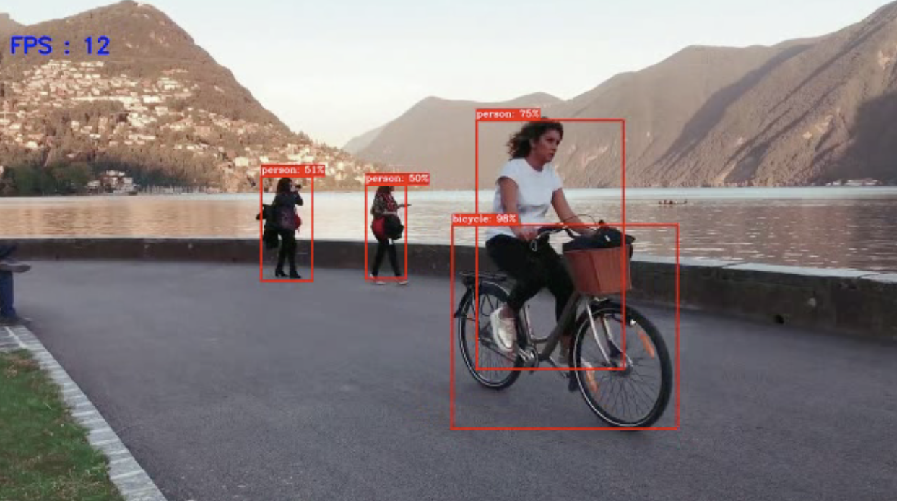

# object-detection-and-tracking
Separate implementations of object detection and tracking using OpenCV and Python.

## detect.py (object detection on video)
Uses MobileNet-SSD v2 architecture trained on COCO dataset. Retrieve frozen_inference_graph.pb from https://github.com/opencv/opencv/wiki/TensorFlow-Object-Detection-API. Check out cycle_bbox.mp4 for a video with object detection applied through this program.

## track.py (tracking on video)
Available trackers = ['BOOSTING', 'MIL', 'KCF', 'TLD', 'MEDIANFLOW', 'MOSSE', 'CSRT'].

## kalmanfilter.py (tracking on video)
Tracker uses Kalman Filter with HOG person detector.

